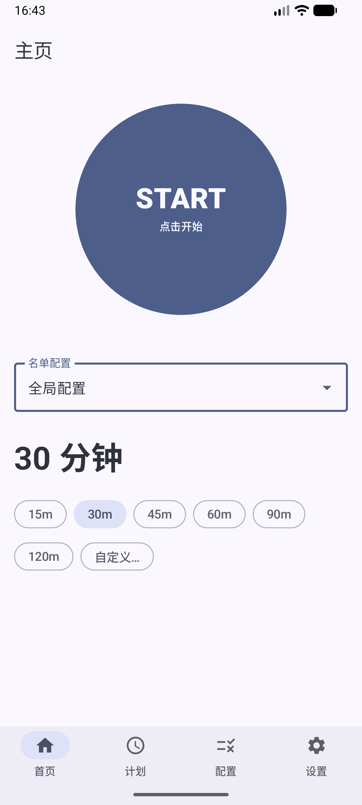
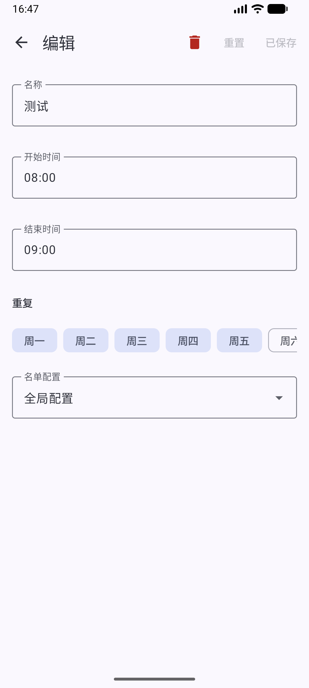
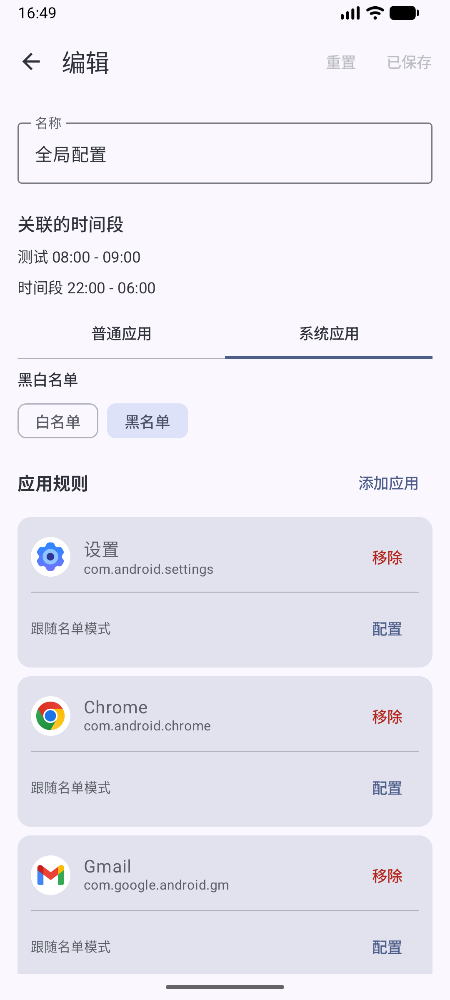
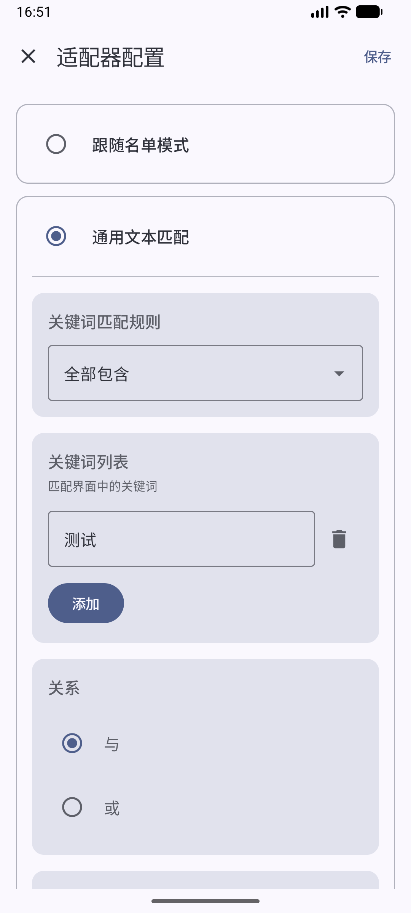
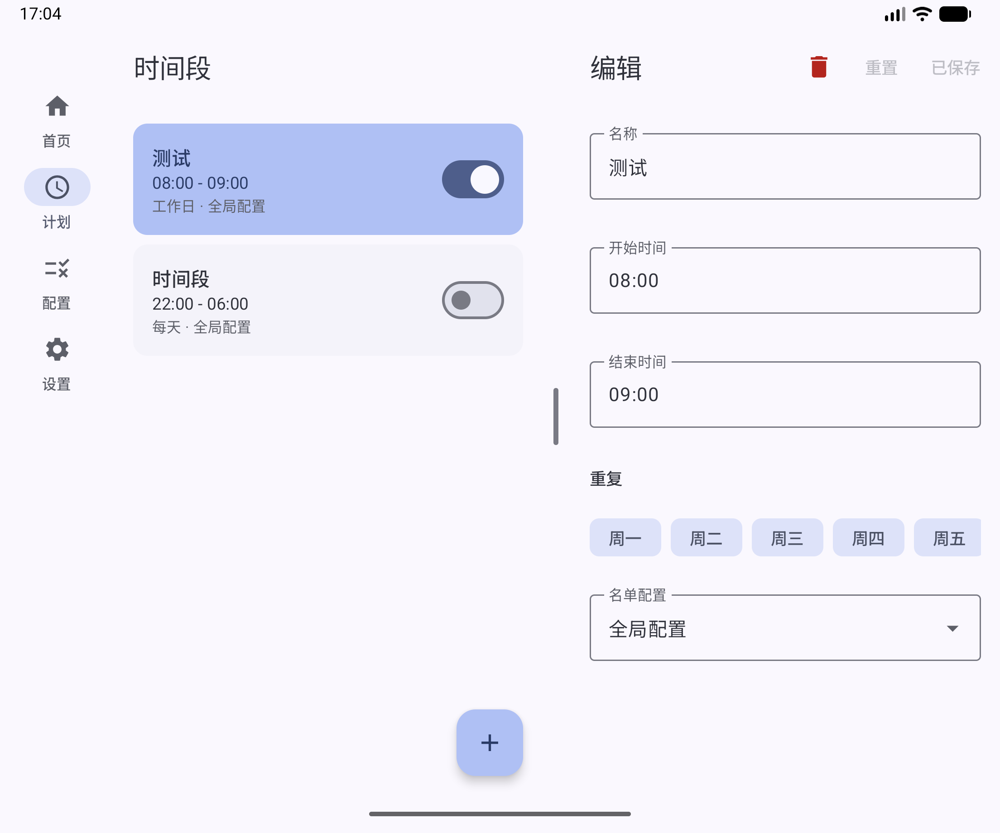

# Focus Lock

一个用来锁机的 Android 应用，帮助你把让人分心的 App 拦在外面。

> [!NOTE]
> README 由 AI 生成，有些地方可能不太准确。
> 应用名称还未确定，仓库里暂时先叫 Focus Lock，应用图标由 AI 生成。

## 主要功能

- **手动锁机**：在首页选好配置和时长（如 15/30/60 分钟），点击 START 即可开始。
- **定时锁机**：按星期几 + 起止时间设置时间段，到点自动生效，支持跨天和优先级排序。
- **黑白名单**：每个配置可以分别设置「普通应用」和「系统应用」是白名单还是黑名单。
- **单应用规则**：可以对某个 App 单独配置拦截逻辑，而不只是简单地锁或不锁。
- **约束机制**：锁机开始前有约 15 秒的警告倒计时；每次锁机最多暂停 3 分钟；紧急解除每月 3 次。
- **保活与修复**：提供无障碍服务守护，服务被系统关掉时会尝试恢复（需要 adb 授予 `WRITE_SECURE_SETTINGS`，属于实验性功能）。

### 内置的应用适配器

除了基础的黑白名单，部分 App 可以配置更细的规则：

- **哔哩哔哩**：拦截视频详情页与全屏播放，可按 UP 主 / 视频标题关键词放行。
- **微信**：由于微信限制，目前支持 Activity 级别的拦截，可分别拦截朋友圈、视频号、小程序。
- **通用文本匹配**：按界面关键词或 Activity 类名匹配，执行拦截或放行。

## 截图

|                                                                              首页                                                                               |                                                                                       时间段                                                                                       |                                                                                      配置                                                                                       |
|:-------------------------------------------------------------------------------------------------------------------------------------------------------------:|:-------------------------------------------------------------------------------------------------------------------------------------------------------------------------------:|:-----------------------------------------------------------------------------------------------------------------------------------------------------------------------------:|
| <picture><source media="(prefers-color-scheme: dark)" srcset="./docs/images/screenshot_home_dark.png"></picture> | <picture><source media="(prefers-color-scheme: dark)" srcset="./docs/images/screenshot_schedule_edit_dark.png"></picture> | <picture><source media="(prefers-color-scheme: dark)" srcset="./docs/images/screenshot_profile_edit_dark.png"></picture> |

|                                                                                 适配器                                                                                 |                                                                                      大屏                                                                                       |
|:-------------------------------------------------------------------------------------------------------------------------------------------------------------------:|:-----------------------------------------------------------------------------------------------------------------------------------------------------------------------------:|
| <picture><source media="(prefers-color-scheme: dark)" srcset="./docs/images/screenshot_adapter_dark.png"></picture> | <picture><source media="(prefers-color-scheme: dark)" srcset="./docs/images/screenshot_large_screen_dark.png"></picture> |

## 注意事项

- 应用依赖无障碍服务来识别当前前台应用，需要手动在系统设置里开启。
- 因各家系统差异较大，锁机效果、保活、自动恢复等行为在部分机型上可能不稳定。
- 建议先启动一个 2 分钟的手动锁机，确认各功能正常后再使用定时锁机。

> [!CAUTION]
> ColorOS 16 用户：如果你遇到无障碍服务被系统关闭，请打开手机管家 → 实用工具 → 风险行为拦截 → 点击右上角的“⋮”将本应用加入拦截白名单。
> 其他厂商系统也可能有类似的拦截机制，请自行查找。

## 关于此项目

我的开发能力比较有限，这个项目基本是边学边做，代码里可能还有不少可以改进、甚至写得不合理的地方，欢迎指出。

## 技术栈

- Jetpack Compose
- minSdk = 24 (Android 7.0)

## 致谢

开发过程中参考了以下项目的代码，在此表示感谢：

- [android/nav3-recipes](https://github.com/android/nav3-recipes)
- [gkd-kit/gkd](https://github.com/gkd-kit/gkd)
- [Snownamida/touch-grass](https://github.com/Snownamida/touch-grass)

## 许可证

本项目基于 [GPL-3.0](LICENSE) 许可发布。
